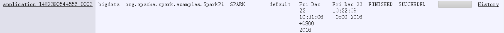
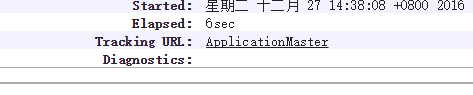
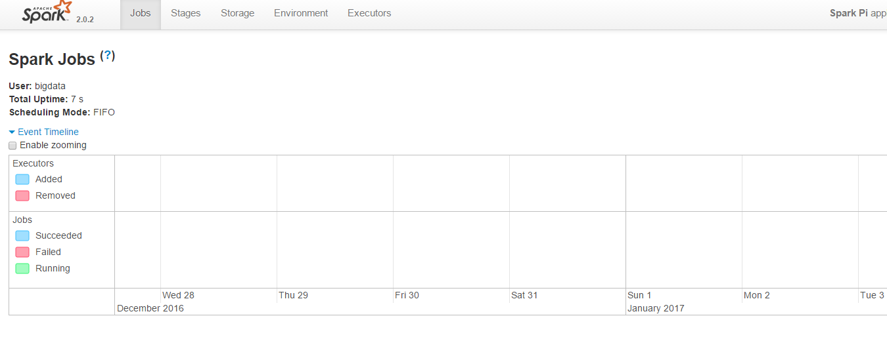
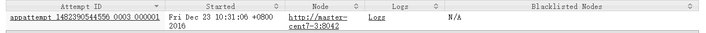

<br>

## 目录

[TOC]

## 0 简介

### 0.1 项目目标

**工业** **大数据** **实时** **分析** 与 **可视化**

### 0.2 系统简介

系统版本:

    OS:        CentOS 7 1511 版
    Python:    2.7.5 (CentOS 7 自带)
    Java:      1.8.0_65 (CentOS 7 自带)
    Hadoop     2.7.3
    HBase      1.2.4
    Spark:     2.0.2
    Kafka:     0.9.0.1

IP 及 端口 分配:

| IP            | Hostname |
| ------------- | -------- |
| 192.168.1.170 | master   |
| 192.168.1.171 | slave1   |
| 192.168.1.172 | slave2   |
| 192.168.1.173 | slave3   |

* 建议直接在 firewall 中配置这些机器之间的互访不做端口过滤. 使用 rich rule: 对指定的 IP 不做拦截. 例如要设置来自 192.168.1.1 的访问不做端口过滤, 命令如下

```bash
sudo firewall-cmd --permanent --add-rich-rule="rule family='ipv4' source address='192.168.1.1' accept"
```

* 而对外开放的端口有:

* Hadoop
    * master 8088(Yarn) 19888(JobHistory) 50070(HDFS NameNode)
    * slave1 50090(HDFS SecondaryNameNode)
* Hbase
    * master 16010(HBase web-UI)
* Spark
    * 没有

## 1 Hadoop

1 台 master, 3 台 slave

| 机器名 | IP 地址 | 作用 |
| ------ | ------------- | --------------------- |
| master | 192.168.1.170 | NameNode, ResourceManager                |
| slave1 | 192.168.1.171 | DataNode, NodeManager, SecondaryNameNode |
| slave2 | 192.168.1.172 | DataNode, NodeManager                    |
| slave3 | 192.168.1.173 | DataNode, NodeManager                    |

* 建议直接在 firewall 中配置这些机器之间的互访不做端口过滤. 使用 rich rule: 对指定的 IP 不做拦截. 例如要设置来自 192.168.1.1 的访问不做端口过滤, 命令如下

```bash
sudo firewall-cmd --permanent --add-rich-rule="rule family='ipv4' source address='192.168.1.1' accept"
```

* 而对外开放的端口有: master 机上的 8088(Yarn) 19888(JobHistory) 50070(HDFS NameNode), slave1 机上的 50090(HDFS SecondaryNameNode)

### 1.1 前置

* 安装 JDK: sun JDK or openJDK `sudo yum install java-1.8.0-openjdk-devel.x86_64`
* IP 映射: 配置每台机器的 /etc/hosts 保证各台机器之间通过机器名可以互访
* master 机对 slave 机能够 ssh 免密码登陆: 将 master 机的 ssh 公钥文件 id_rsa.pub 的内容追加到 authorized_keys 中即可

在 master 机上

```bash
cd ~                                                # 最好在要配置的用户的家目录下
ssh-keygen -t rsa -P '' -f ~/.ssh/id_rsa            # 生成 rsa 密钥对, 也可以选 dsa

scp ~/.ssh/id_rsa.pub username@slave1:~/master.pub  # 将 master 机公钥文件 id_rsa.pub 传送到两个从机
scp ~/.ssh/id_rsa.pub username@slave2:~/master.pub
scp ~/.ssh/id_rsa.pub username@slave3:~/master.pub
```

在 slave 机上

```bash
cat ~/master.pub >> ~/.ssh/authorized_keys
chmod 644 ~/.ssh/authorized_keys                 # 修改权限
ssh master                                       # 验证, 第一次要输入 'yes' 确认加入 the list of known hosts
```

### 1.2 下载与解压

下载: http://hadoop.apache.org/releases.html

```bash
tar xzf hadoop-2.7.3.tar.gz -C /home/bigdata
```

### 1.3 配置环境变量: 在 /etc/profile (or ~/.bashrc) 添加如下内容, 然后 重新登陆 或 source /etc/profile (or ~/.bashrc)

**四台机器上都要做**

```bash
export HADOOP_HOME=/home/bigdata/hadoop-2.7.3
export PATH=$PATH:$HADOOP_HOME/bin:$HADOOP_HOME/sbin

export CLASSPATH=$CLASSPATH:`$HADOOP_HOME/bin/hadoop classpath --glob`
```

### 1.4 更改所属权

若是安装到 `/usr/local` 目录下, 要对用户账户赋予所属权

```bash
sudo chown -R will:will $HADOOP_HOME
```

### 1.5 配置 Hadoop

**四台机器的配置完全一样, 只需配置完一台, 再复制到其余三台机器上就行**

#### 1.5.1 HDFS 配置文件

* `$HADOOP_HOME/etc/hadoop/hadoop-env.sh` hadoop 运行环境配置, 修改如下位置

```bash
export JAVA_HOME=/usr/lib/jvm/java
```

* `$HADOOP_HOME/etc/hadoop/core-site.xml`

```bash
<configuration>
    <property>
        <name>fs.defaultFS</name>
        <value>hdfs://master:9000</value>
        <description>配置 NameNode 的 URI, 位置为主机的 9000 端口</description>
    </property>
    <property>
        <name>hadoop.tmp.dir</name>
        <value>/home/bigdata/work/hdfs</value>    -------------自己设!
        <description>配置 hadoop 的 tmp 目录的根位置, 最好配置, 如果在新增节点或者其他情况下莫名其妙的 DataNode 启动不了, 就删除此 tmp 目录即可. 不过如果删除了 NameNode 机器的此目录, 那么就需要重新执行 HDFS 格式化的命令.</description>
    </property>
</configuration>
```

* `$HADOOP_HOME/etc/hadoop/hdfs-site.xml` HDFS 的配置文件

```bash
<configuration>
    <property>
        <name>dfs.http.address</name>
        <value>master:50070</value>
        <description>配置 HDFS 的 http 的访问位置</description>
    </property>
    <property>
        <name>dfs.namenode.secondary.http-address</name>
        <value>slave1:50090</value>
        <description>指定运行 SecondaryNameNode 的机器 hostname 及 web-UI 端口</description>
    </property>
    <property>
        <name>dfs.replication</name>
        <value>3</value>
        <description>配置文件块的副本数, 不能大于从机的个数, 一般设为 3</description>
    </property>
</configuration>
```

PS: 还可以配置下面两个属性

    * dfs.namenode.name.dir 在本地文件系统上, NameNode 永久存储命名空间和事务日志的路径. 如果这是以逗号分隔的目录列表, 那么将在所有目录中复制名称表, 以实现冗余.
    * dfs.datanode.data.dir 在本地文件系统上, DataNode 存储文件块的路径. 如果这是以逗号分隔的目录列表, 则数据将存储在所有命名目录中, 通常在不同的设备上.

* `$HADOOP_HOME/etc/hadoop/slaves`

```bash
# 设置从节点 hostname, 一行一个
slave1
slave2
slave3
```

#### 1.5.2 Yarn 配置文件

* `$HADOOP_HOME/etc/hadoop/yarn-env.sh` yarn 运行环境配置, 修改如下位置

```bash
export JAVA_HOME=/usr/lib/jvm/java
```

* `$HADOOP_HOME/etc/hadoop/yarn-site.xml`

```bash
<configuration>
    <property>
        <name>yarn.nodemanager.aux-services</name>
        <value>mapreduce_shuffle</value>
    </property>
    <property>
        <name>yarn.resourcemanager.webapp.address</name>
        <value>master:8088</value>
        <description>yarn 的 web UI</description>
    </property>
    <property>
        <name>yarn.resourcemanager.hostname</name>
        <value>master</value>
    </property>
</configuration>
```

* `$HADOOP_HOME/etc/hadoop/mapred-site.xml` 先把模板文件复制一份

```bash
cp mapred-site.xml.template mapred-site.xml
```

配置如下

```bash
<configuration>
    <property>
        <name>mapreduce.framework.name</name>
        <value>yarn</value>
    </property>
    <property>
        <name>mapreduce.jobhistory.address</name>
        <value>master:10020</value>
    </property>
    <property>
        <name>mapreduce.jobhistory.webapp.address</name>
        <value>master:19888</value>
        <description>jobhistory 的 web UI</description>
    </property>
</configuration>
```

#### 1.5.3 用 scp 拷贝 slave 机上

```bash
scp -r ~/hadoop-2.7.3 username@slave1:~
scp -r ~/hadoop-2.7.3 username@slave2:~
scp -r ~/hadoop-2.7.3 username@slave3:~
```

#### 1.5.4 hdfs init

第一次启动 HDFS 时, 必须格式化, 在 shell 中执行: `hdfs namenode -format`

#### 1.5.5 启动与关闭

* hdfs 启动

```bash
start-dfs.sh
```

然后打开页面验证 hdfs 安装成功: http://master_hostname:50070/

* hdfs 关闭

```bash
stop-dfs.sh
```

* yarn 启动

```bash
start-yarn.sh
```

然后打开页面验证 yarn 安装成功: http://master_hostname:8088/

* yarn 关闭

```bash
stop-yarn.sh
```

### 1.6 Tips

* 在 master/slave 机器上执行 `jps` 命令可以看到后台运行的 java 程序

```bash
[bigdata@master ~]$ jps
43206 NameNode
43551 ResourceManager
43950 Jps
```

```bash
[bigdata@slave1 ~]$ jps
32019 DataNode
33398 SecondaryNameNode
32658 NodeManager
33267 Jps
```

```bash
[bigdata@slave2 ~]$ jps
32019 DataNode
32658 NodeManager
33267 Jps
```

* hadoop 组件的 web-ui
    * NameNode http://master_hostname:50070
    * ResourceManager http://master_hostname:8088
    * MapReduce JobHistory 服务器 http://master_hostname:19888  (这个的话, 要先启动 `mr-jobhistory-daemon.sh start historyserver`, 关闭命令是 `mr-jobhistory-daemon.sh stop historyserver`)
* 先开 hdfs, 再开 yarn; 先关 yarn, 再关 hdfs
* [hdfs shell 常用命令](hdfs)
* 遇到问题时, 先查看 logs, 很有帮助
* start-balancer.sh, 可以使 DataNode 节点上选择策略重新平衡 DataNode 上的数据块的分布
* 添加节点:
    * 建立 ssh 无密访问
    * 在 master 机器的 $HADOOP_HOME/etc/hadoop/slave 文件中添加新机器的 hostname
    * 将主机的 hadoop 所有文件拷贝到新机器(scp 命令), 根据新机器的环境不同改一下配置文件(如 $JAVA_HOME)
    * 配置环境变量: $HADOOP_HOME 等

## 2 HBase

1 台 master, 3 台 slave

| HostName | IP              | Master | RegionServer |
| -------- | --------------- | ------ | ------------ |
| master   | 192.168.125.170 | yes    | no           |
| slave1   | 192.168.125.171 | backup | yes          |
| slave2   | 192.168.125.172 | no     | yes          |
| slave3   | 192.168.125.173 | no     | yes          |

* 建议直接在 firewall 中配置这些机器之间的互访不做端口过滤. 使用 rich rule: 对指定的 IP 不做拦截. 例如要设置来自 192.168.1.1 的访问不做端口过滤, 命令如下

```bash
sudo firewall-cmd --permanent --add-rich-rule="rule family='ipv4' source address='192.168.1.1' accept"
```

* 而对外开放的端口有: 16010(HBase web-UI)

### 2.1 前置

安装 JDK 与 Hadoop(见[Hadoop 部署](# 1 Hadoop))

### 2.2 下载与解压

下载: http://www.apache.org/dyn/closer.cgi/hbase/

```bash
tar xzf hbase-1.2.4-bin.tar.gz -C /home/bigdata
```

PS: 确保你下载的版本与你现存的 Hadoop 版本兼容([兼容列表](http://hbase.apache.org/book.html#hadoop))

### 2.3 配置环境变量: 在 /etc/profile (or ~/.bashrc) 添加如下内容, 然后 重新登陆 或 source /etc/profile (or ~/.bashrc)

**四台机器上都要做**

```bash
export HBASE_HOME=/home/bigdata/hbase-1.2.4
export PATH=$PATH:$HBASE_HOME/bin
```

### 2.4 更改所属权

若是安装到 `/usr/local` 目录下, 要对用户账户赋予所属权

```bash
sudo chown -R will:will $HBASE_HOME
```

### 2.5 配置文件

**四台机器的配置完全一样, 只需配置完一台, 再复制到其余三台机器上就行**

* `$HBASE_HOME/conf/hbase-env.sh`

```bash
export JAVA_HOME=/usr/lib/jvm/java

# 使用独立的 ZooKeeper 而不使用内置 ZooKeeper
export HBASE_MANAGES_ZK=false
```

* `$HBASE_HOME/conf/hbase-site.xml`

```bash
<configuration>
    <property>
        <name>hbase.rootdir</name>
        <value>hdfs://master:9000/hbase</value>
        <description>是 hadoop 配置中 fs.defaultFS 的下级目录</description>
    </property>
    <property>
        <name>hbase.cluster.distributed</name>
        <value>true</value>
    </property>

    <!-- 因为我们用自己的 zookeeper, 所以不设置下面这几项 -->
    <!-- <property>
        <name>hbase.zookeeper.quorum</name>
        <value>master,slave1,slave2,slave3</value>
        <description>zookeeper 集群列表</description>
    </property>
    <property>
        <name>hbase.zookeeper.property.dataDir</name>
        <value>/home/bigdata/tmp/hbase-data</value>
        <description>对应 zookeeper/config/zoo.cfg 中的 dataDir</description>
    </property> -->
</configuration>
```

* `$HBASE_HOME/conf/regionservers` 去掉 localhost, 添加运行 RegionServer 的机器的 hostname(一行一条)

```bash
slave1
slave2
slave3
```

* 配置 backup Master, 在 `conf/` 目录下建立文件 `backup-masters`, 添加作为 backup Master 的机器的 hostname(一行一条)

```bash
slave1
```

* 以上在一台机器上就配置完了, 传送到所有机器上就行了

```bash
scp -r ~/hbase-1.2.4 username@slave1:~
scp -r ~/hbase-1.2.4 username@slave2:~
scp -r ~/hbase-1.2.4 username@slave3:~
```

### 2.6 启动与关闭

* **启动: 只需在 master 机上运行下面这条命令就行了**

```bash
start-hbase.sh
```

验证

* web-UI: http://master:16010
* 终端执行 `jps`, 显示如下

master 机

```bash
$ jps
20355 Jps
20137 HMaster
```

slave 机

```bash
$ jps
13901 Jps
13737 HRegionServer
```

* **关闭**

```bash
stop-hbase.sh
```

### 2.7 hbase shell

* 用 shell 连接 HBase.

```bash
bin/hbase shell
```

* 输入 help 然后 Enter 可以看到 hbase shell 命令的帮助. 要注意的是表名, 行和列需要加引号.

* create: 建表

```bash
hbase(main):001:0> create 'test', 'cf'
0 row(s) in 0.4170 seconds

=> Hbase::Table - test
```

* list: 列出所有表

```bash
hbase(main):002:0> list 'test'
TABLE
test
1 row(s) in 0.0180 seconds

=> ["test"]
```

* put: 插入行

```bash
hbase(main):003:0> put 'test', 'row1', 'cf:a', 'value1'
0 row(s) in 0.0850 seconds

hbase(main):004:0> put 'test', 'row2', 'cf:b', 'value2'
0 row(s) in 0.0110 seconds

hbase(main):005:0> put 'test', 'row3', 'cf:c', 'value3'
0 row(s) in 0.0100 seconds
```

* scan: 全表输出

```bash
hbase(main):006:0> scan 'test'
ROW                                      COLUMN+CELL
 row1                                    column=cf:a, timestamp=1421762485768, value=value1
 row2                                    column=cf:b, timestamp=1421762491785, value=value2
 row3                                    column=cf:c, timestamp=1421762496210, value=value3
3 row(s) in 0.0230 seconds
```

* get: 输出一行

```bash
hbase(main):007:0> get 'test', 'row1'
COLUMN                                   CELL
 cf:a                                    timestamp=1421762485768, value=value1
1 row(s) in 0.0350 seconds
```

* 删除表: 先 disable 表, 再 drop 表. 可以 re-enable 表

* disable: Disable 表

```bash
hbase(main):008:0> disable 'test'
0 row(s) in 1.1820 seconds
```

* enable: Enable 表

```bash
hbase(main):009:0> enable 'test'
0 row(s) in 0.1770 seconds

hbase(main):010:0> disable 'test'
0 row(s) in 1.1820 seconds
```

* drop: Drop 表

```bash
hbase(main):011:0> drop 'test'
0 row(s) in 0.1370 seconds
```

* exit: 退出 hbase shell

```bash
hbase(main):012:0> exit
```

### 2.8 修改 ulimit 限制

HBase 会在同一时间打开大量的文件句柄和进程, 超过 Linux 的默认限制, 导致可能会出现如下错误.

```bash
2010-04-06 03:04:37,542 INFO org.apache.hadoop.hdfs.DFSClient: Exception increateBlockOutputStream java.io.EOFException
2010-04-06 03:04:37,542 INFO org.apache.hadoop.hdfs.DFSClient: Abandoning block blk_-6935524980745310745_1391901
```

所以编辑 `/etc/security/limits.conf` 文件, 添加以下两行, 提高能打开的句柄数量和进程数量. 注意将 `bigdata` 改成你运行 HBase 的用户名.

```bash
bigdata  -       nofile  32768
bigdata  -       nproc   32000
```

还需要在 `/etc/pam.d/common-session` 加上这一行:

```bash
session required pam_limits.so
```

否则在 `/etc/security/limits.conf` 上的配置不会生效.

最后还要注销(`logout` 或者 `exit`)后再登录, 这些配置才能生效! 使用 `ulimit -n -u` 命令查看最大文件和进程数量是否改变了. 记得在每台安装 HBase 的机器上运行哦.

## 3 Spark on YARN 部署

Spark 官方提供了三种集群部署方案: Standalone, Mesos, Yarn. 因为我们还将用到 HBase, 所以选择 Yarn 做 Spark 集群管理.

| IP            | Hostname |
| ------------- | -------- |
| 192.168.1.170 | master   |
| 192.168.1.171 | slave1   |
| 192.168.1.172 | slave2   |
| 192.168.1.173 | slave3   |

* 建议直接在 firewall 中配置这些机器之间的互访不做端口过滤. 使用 rich rule: 对指定的 IP 不做拦截. 例如要设置来自 192.168.1.1 的访问不做端口过滤, 命令如下

```bash
sudo firewall-cmd --permanent --add-rich-rule="rule family='ipv4' source address='192.168.1.1' accept"
```

* 而对外开放的端口有: (Spark on YARN 没有需要单独配置的对外开放端口)

Spark on YARN 的配置很简单, 只需要配置好 `YARN 集群`, 然后在一台机器上解压 Spark 包, 在提交 spark 程序时, 指定 master 参数为 yarn, deploy-mode 参数为 cluster 或 client, 即可.

### 3.1 安装配置 Hadoop

详见 [Hadoop 部署](# 1 Hadoop))

### 3.2 下载与解压

下载: http://spark.apache.org/downloads.html, 选择 spark-2.0.2-bin-hadoop2.7.tgz

```bash
tar xzf spark-2.0.2-bin-hadoop2.7.tgz -C /home/bigdata
```

### 3.3 配置环境变量: 在 /etc/profile (or ~/.bashrc) 添加如下内容, 然后 重新登陆 或 source /etc/profile (or ~/.bashrc)

```bash
export SPARK_HOME=/home/bigdata/spark-2.0.2-bin-hadoop2.7
export PATH=$PATH:$SPARK_HOME/bin
```

### 3.4 启动 HDFS & YARN

```bash
start-dfs.sh
start-yarn.sh
```

### 3.5 在 Yarn 上运行 Spark 程序

以 YARN-cluster 形式提交示例程序

```bash
cd $SPARK_HOME
bin/spark-submit --class org.apache.spark.examples.SparkPi \
    --master yarn \
    --deploy-mode cluster \
    examples/jars/spark-examples*.jar \
    10
```

到 Yarn-UI(http://master_hostname:8088), 找到任务



点进去, 左上角的 `Kill Application` 用于关闭这个任务


中间的 `ApplicationMaster` 可以跳转到 Spark-UI 查看 spark 对这个任务的 UI 界面





下面的是对这个任务的描述, 如下, 只在一个节点上运行, 点击 `Logs` 可以查看 logs 输出



这是示例程序的输出


